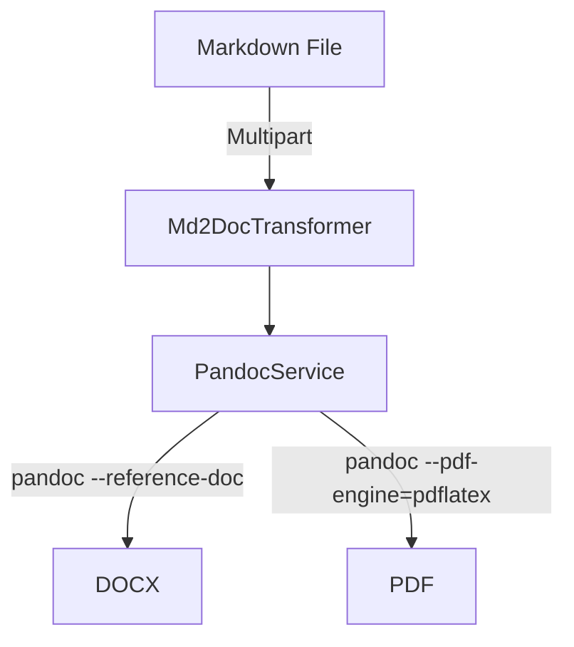

# alf-tengine-md2doc
[](pom.xml)
[](compose.yaml)
[](LICENSE)

Alfresco Transform Engine that converts Markdown files to DOCX and PDF using [Pandoc](https://pandoc.org/).

## Features

| Capability | Details |
|---|---|
| Markdown to DOCX | Produces styled Word documents using a customizable reference template |
| Markdown to PDF | Generates PDF via XeLaTeX with full Unicode support and proper typography |
| Table of Contents | Optional TOC generation with configurable heading depth |
| Alfresco‑ready | Implements the Alfresco Transform Core SPI (`TransformEngine` & `CustomTransformer`) |
| Containerised | Multi‑stage Docker build (Java 17 + Pandoc + TeXLive) |
| Configurable | All knobs live in `application-default.yaml` or environment variables |

## Quick Start

### 1. Prerequisites

* Java 17 & Maven 3.9+ (for local builds)
* Docker (for running the service)

### 2. Run with Docker Compose

```bash
git clone git@github.com:aborroy/alf-tengine-md2doc.git
cd alf-tengine-md2doc
docker compose up --build -d
```

*Service will be reachable at [http://localhost:8090](http://localhost:8090)*

Test it:

```bash
# Markdown to DOCX
curl -X POST \
     -F "file=@/path/to/document.md" \
     "http://localhost:8090/transform?sourceMimetype=text/markdown&targetMimetype=application/vnd.openxmlformats-officedocument.wordprocessingml.document" \
     -o output.docx

# Markdown to PDF
curl -X POST \
     -F "file=@/path/to/document.md" \
     "http://localhost:8090/transform?sourceMimetype=text/markdown&targetMimetype=application/pdf" \
     -o output.pdf
```

Optionally, Table of Contents can be enabled as a parameter:

```bash
curl -X POST \
     -F "file=@/path/to/document.md" \
     "http://localhost:8090/transform?sourceMimetype=text/markdown&targetMimetype=application/pdf&tocEnabled=true&tocDepth=2" \
     -o output-toc.pdf
```

### 3. Build & run locally

```bash
mvn clean package -DskipTests
java -jar target/alf-tengine-md2doc-1.0.0.jar
```

The app listens on `:8090` by default.

## Configuration

| Property | Default | Purpose |
|---|---|---|
| `spring.servlet.multipart.max-file-size` | `100MB` | Max upload size |
| `spring.servlet.multipart.max-request-size` | `100MB` | Max request size |
| `transform.pandoc.toc.enabled` | `false` | Enable Table of Contents by default |
| `transform.pandoc.toc.depth` | `3` | Default TOC heading depth (1-6) |
| `transform.pandoc.pdf.engine` | `xelatex` | LaTeX engine for PDF generation |

Edit `src/main/resources/application-default.yaml` or supply env vars/`-D` flags.

### Testing with the HTML Interface

After starting the service, open the test application at [http://localhost:8090](http://localhost:8090). Use the following input values:

- **file**: Upload a Markdown file
- **sourceMimetype**: `text/markdown`
- **targetMimetype**: `application/vnd.openxmlformats-officedocument.wordprocessingml.document` or `application/pdf`
- **tocEnabled**: `true` (don't set a value to this parameter for using default)
- **tocDepth**: `3` (don't set a value to this parameter for using default depth)

Click the **Transform** button to process the Markdown file.

## Custom DOCX Styling

The project includes a `reference.docx` template that controls the styling of DOCX output. The template defines:

- **Calibri** font family for body text and headings
- Blue color scheme for headings (H1 deep blue → H3 light blue)
- **Consolas** monospace for code blocks
- 2.5 cm page margins
- Centered page numbers in the footer
- 1.15 line spacing for body text

To customize, edit `reference.docx` in Word (modify fonts, headings, page layout, etc.) and rebuild the Docker image. You can also generate a fresh baseline with:

```bash
pandoc -o reference.docx --print-default-data-file reference.docx
```

## Building the Docker Image

### Requirements

- Docker 4.30+

### Building the Image

From the project root directory, build the Docker image with:

```bash
docker build . -t alf-tengine-md2doc
```

This will create a Docker image named `alf-tengine-md2doc:latest` in your local Docker repository.

## Build and Publish to Your Docker Registry

If you want to build and publish your own version of the image (e.g., to your own Docker Hub account or private registry), follow these steps.

### Enable Buildx (if not already enabled)

```bash
docker buildx create --name multiarch-builder --use
docker buildx inspect --bootstrap
```

### Build and Push Multi-Arch Image

Replace `yourdockeruser` with your Docker Hub username or private registry path:

```bash
docker buildx build --no-cache \
  --platform linux/amd64,linux/arm64 \
  --attest type=sbom --attest type=provenance,mode=max \
  --tag yourdockeruser/alf-tengine-md2doc:latest \
  --push .
```

This command:

* Builds the image for both `amd64` and `arm64` architectures.
* Tags it as `yourdockeruser/alf-tengine-md2doc:latest`.
* Pushes it to your specified registry.

> Make sure you're logged into your Docker registry before pushing:

```bash
docker login
```

## Deploying with Alfresco Community 25.x

Ensure your `compose.yaml` file includes the following configuration:

```yaml
services:
  alfresco:
    environment:
      JAVA_OPTS : >-
        -DlocalTransform.core-aio.url=http://transform-core-aio:8090/
        -DlocalTransform.md2doc.url=http://transform-md2doc:8090/

  transform-core-aio:
    image: alfresco/alfresco-transform-core-aio:5.2.5

  transform-md2doc:
    image: yourdockeruser/alf-tengine-md2doc
```

Key Configuration Updates:

- Add `localTransform.md2doc.url` to the Alfresco service (`http://transform-md2doc:8090/` by default)
- Define the `transform-md2doc` service using the custom-built image

*Ensure you have built the Docker image (`alf-tengine-md2doc`) before running Docker Compose.*

## Deploying with Alfresco Enterprise 25.x

Ensure your `compose.yaml` file includes the following configuration:

```yaml
services:
  alfresco:
    environment:
      JAVA_OPTS : >-
        -Dtransform.service.enabled=true
        -Dtransform.service.url=http://transform-router:8095
        -Dsfs.url=http://shared-file-store:8099/

  transform-router:
    image: quay.io/alfresco/alfresco-transform-router:4.2.4
    environment:
      CORE_AIO_URL: "http://transform-core-aio:8090"
      TRANSFORMER_URL_MD2DOC: "http://transform-md2doc:8090"
      TRANSFORMER_QUEUE_MD2DOC: "md2doc-engine-queue"

  transform-md2doc:
    image: yourdockeruser/alf-tengine-md2doc
    environment:
      ACTIVEMQ_URL: "nio://activemq:61616"
      FILE_STORE_URL: >-
        http://shared-file-store:8099/alfresco/api/-default-/private/sfs/versions/1/file
```

Key Configuration Updates:

- Register the Markdown transformer with `transform-router`
    - URL: `http://transform-md2doc:8090/` (default)
    - Queue Name: `md2doc-engine-queue` (defined in `application-default.yaml`)
- Define the `transform-md2doc` service and link it to ActiveMQ and Shared File Store services

*Ensure you have built the Docker image (`alf-tengine-md2doc`) before running Docker Compose.*

## Internals



* `Md2DocEngine` — Declares the Alfresco Engine (`md2doc`) and its capabilities
* `Md2DocTransformer` — Streams the Markdown to a temp file and invokes `PandocService`
* `PandocService` — Builds and executes the Pandoc CLI command with the appropriate flags for each target format

## License

Apache License 2.0 (project code). Pandoc is licensed under GPL v2+.
